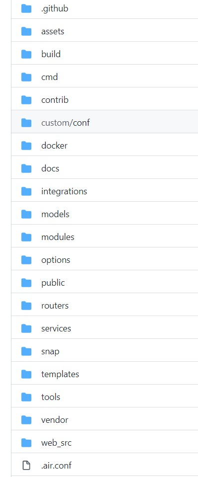
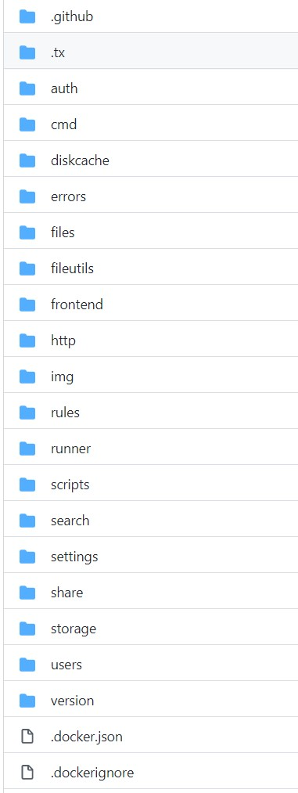

>* 原文来自：https://github.com/suhanyujie/hello_go/blob/master/notes/2021/go_pro_dir_struct.md
>* 文章标题：go 项目目录的结构
>* 作者：[suhanyujie](https://github.com/suhanyujie)
>* 标签：go，项目目录，go 初学
>* tip：如果异常，还请指正~

## go 项目目录的结构
使用 go 开发也快一年了，对 go 的了解还是有很大的提高空间。在这近一年来，很多时候，知道 go 很灵活，无论是从语法使用上，还是从项目结构组织上，都具备很大的灵活性。
但过大的灵活性也带来了百家齐放、无固定标准，进而导致一些初学者很疑惑。

go 官方自从 1.11、1.12 版本的 go 开始引入了 [go module](https://go.dev/blog/using-go-modules)，让 go 语言的项目结构变得越来越好用。以前，我们的项目要放入 GOPATH
 中，而如今，开启了 go module 后，随处 mod init 就能产生一个新项目，使用 `go get` 命令引入三方包。而当你下载别人的项目时，只需要用 `go list -m all` 就能轻松地下载所有依赖，从而运行项目。
不得不承认，go 的确很方便、很实用！

但做技术的，遇到不好用的地方，总喜欢吹毛求疵，期望有更好的解决方案。比如：go 的项目如何组织。我们知道 go 的很多仓库都有很长的文件、目录列表，比如下面这个[仓库](https://github.com/go-gitea/gitea)：



再比如另一个[项目](https://github.com/filebrowser/filebrowser)



也许和 go 本身的历史发展有关，但这些目录看起来确实很冗长，不够简洁。

随着 go 社区的发展，社区的开发者们整理出一套符合 go 特性的项目目录结构，并且将其组织成文档放到 [GitHub 上](https://github.com/golang-standards/project-layout)。
其中详细介绍了 go 项目的结构，并且各个目录的作用和设计原因。

```
-youProject
 - cmd                          // 项目主要的应用程序。
   - api                        // 服务端应用程序的目录
   - web                        // Web应用程序的目录
 - internal                     // 私有的应用程序代码库。
 - pkg                          // 外部应用程序可以使用的库代码（如，/pkg/mypubliclib）。
 - vendor                       // 应用程序的依赖关系（通过手动或者使用喜欢的依赖管理工具，如新增的内置Go Modules特性）。
 - configs                      // 配置文件模板或默认配置。
 - init                         // 系统初始化（systemd、upstart、sysv）和进程管理（runit、supervisord）配置。
 - scripts                      // 用于执行各种构建，安装，分析等操作的脚本。
 - build                        // 打包和持续集成。将云（AMI），容器（Docker），操作系统（deb，rpm，pkg）软件包配置和脚本放在/build/package目录中。
 - deployments                  // IaaS，PaaS，系统和容器编排部署配置和模板（docker-compose，kubernetes/helm，mesos，terraform，bosh）。
 - test                         // 外部测试应用程序和测试数据。
 - test                         // 外部测试应用程序和测试数据。
 - docs                         // 设计和用户文档（除了godoc生成的文档）。
 ...
```

这里列举了一些常用的目录，可以根据自己的需要进行删减。更加详细的文档说明可以去[仓库](https://github.com/golang-standards/project-layout)里查看。

## 参考
* https://go.dev/blog/using-go-modules
* 该如何组织 Go 项目结构？ https://zhuanlan.zhihu.com/p/346573562